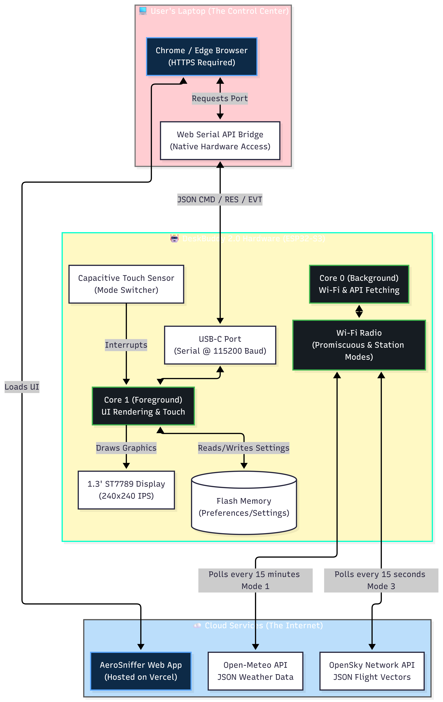
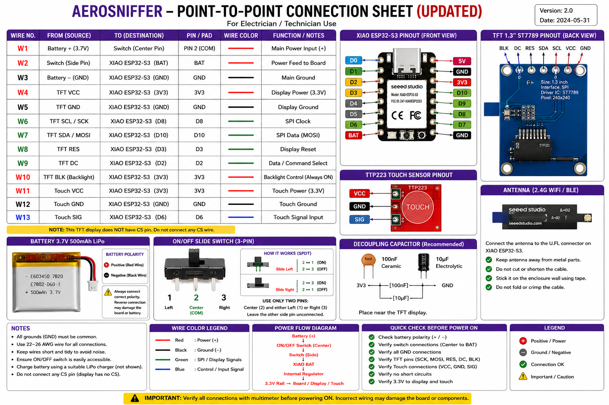
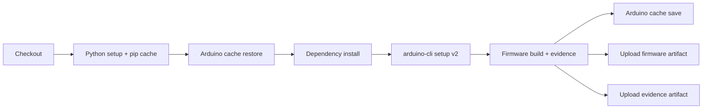
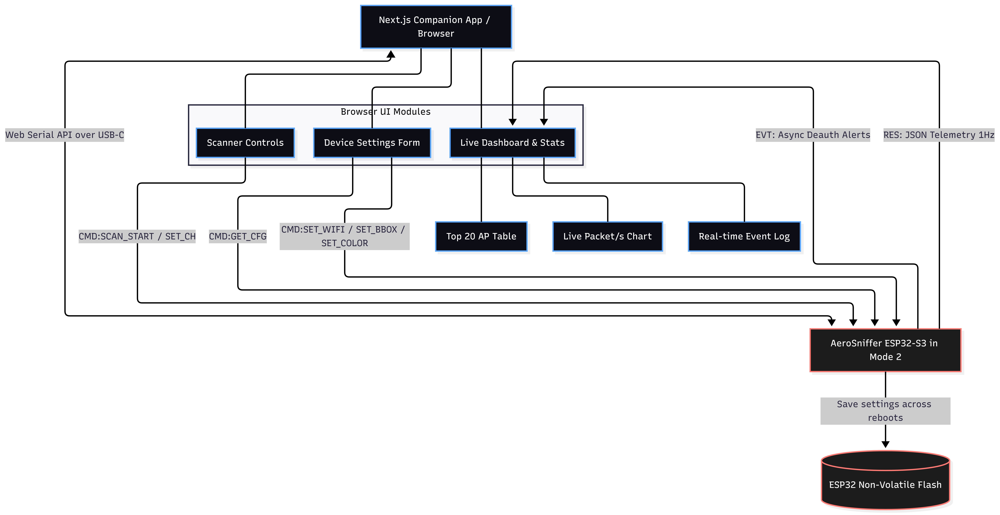

<p align="center">
  
</p>

<p align="center">
  <strong>Multi-Boot ESP32-S3 Desk Gadget — Companion · Security · Aviation</strong><br>
  Three embedded personas, one XIAO ESP32S3, zero compromises.
</p>

<p align="center">
  <a href="https://github.com/aryancodesit/AeroSniffer/actions/workflows/firmware-build.yml">
    
  </a>
  <a href="https://aero-sniffer.vercel.app/">
    
  </a>
  
  
  
</p>

---

## Overview

AeroSniffer is a production-grade embedded systems project that treats the ESP32-S3 as a mini operating system. A long-press on the capacitive touch sensor cycles between three completely independent personas — each with its own renderer, event loop, and hardware state — connected by a shared services layer running on FreeRTOS.

| | |
|---|---|
| **Repository** | [github.com/aryancodesit/AeroSniffer](https://github.com/aryancodesit/AeroSniffer) |
| **Firmware** | C++17, Arduino framework, ESP-IDF 5.x, FreeRTOS |
| **Web Companion** | React + TypeScript + Vite + TanStack Router (shadcn/ui) |
| **PC Agent** | Python (pyserial, psutil, pynput) |
| **CI/CD** | GitHub Actions, arduino-cli v2, evidence framework, pip caching |
| **License** | MIT |

---

## Table of Contents

- [Three Modes](#three-modes)
- [Architecture](#architecture)
- [Hardware](#hardware)
- [Software Stack](#software-stack)
- [Repository Timeline](#repository-timeline)
- [Progress Roadmap](#progress-roadmap)
- [Feature Matrix](#feature-matrix)
- [Release Engineering](#release-engineering)
- [CI/CD Pipeline](#cicd-pipeline)
- [Screenshots](#screenshots)
- [Engineering Metrics](#engineering-metrics)
- [Quick Start](#quick-start)
- [Contributing](#contributing)
- [License](#license)

---

## Three Modes

| Mode | Name | What It Does | Status |
|------|------|--------------|--------|
| 🐾 **Mode 1** | Cyber-Pet Companion | PC-driven interactive desk companion with procedural vector face expressions reacting to typing, CPU load, and active applications | ✅ Released |
| 🛡️ **Mode 2** | Security Sentinel | 802.11 passive monitor with animated radar sweep, deauth detection, captive web portal, and HomeGuard presence awareness | ✅ Released |
| ✈️ **Mode 3** | Aviation Observer | Live ADS-B flight tracker pulling from OpenSky Network API with callsign, altitude, speed, compass heading, and aircraft database lookups | ✅ Released |

A 1.5-second long-press on the capacitive touch sensor cycles through all three modes. FreeRTOS handles clean teardown and re-initialization of all hardware between modes — no reboot needed.

---

## Architecture

```
                        ┌─────────────────────────────────────┐
                        │         AeroSniffer OS Layer         │
                        │  (EventBus · EmotionEngine · Face    │
                        │   Engine · WiFiService · Display     │
                        │   Service · StorageService)          │
                        └──────┬──────────────┬───────────────┘
                               │              │
                 ┌─────────────┴──┐    ┌──────┴──────────────┐
                 │  Core 0 Task   │    │    Core 1 Task      │
                 │  Background    │    │  UI + Rendering     │
                 │  (FFT / netwk) │    │  (Display thread)   │
                 └───────────────┘    └──────────────────────┘
                               │              │
                 ┌─────────────┴──────────────┴───────────────┐
                 │            Mode Lifecycle                   │
                 │  setup_mode(N) → teardown_mode(N)          │
                 │  Clean re-init between each transition      │
                 └────────────────────────────────────────────┘
                               │
        ┌──────────────────────┼──────────────────────┐
        │                      │                      │
   ┌────┴────┐          ┌─────┴─────┐          ┌─────┴────┐
   │ Mode 1  │          │  Mode 2   │          │  Mode 3  │
   │ Pet     │          │  Security │          │ Aviation │
   │ Companion│         │  Portal   │          │ Flight   │
   │ Face    │          │  Sniffer  │          │ Radar    │
   │ Engine  │          │  Threat   │          │ HUD      │
   └─────────┘          │  Engine   │          └──────────┘
                        └───────────┘
```

**Persistence Layer:** CreatureProfile (NVS), MemoryEngine (LittleFS, 4 domains, 64 records), FlightStats
**Observer Layer:** PersistenceService, MemoryEngine (4 domains, 15 subtypes)
**External Interfaces:** USB CDC Serial (commands + telemetry), WiFi SoftAP (Portal REST API + WebSocket), WiFi STA (OpenSky)


---

## Hardware

### Included Components

| Component | Purpose |
|-----------|---------|
| Seeed Studio XIAO ESP32S3 | Main MCU — dual-core Xtensa LX7 @240 MHz, 16 MB flash, 8 MB PSRAM |
| 1.3" ST7789 240×240 IPS Display | SPI-driven, 62 FPS via TFT_eSPI DMA |
| Red Capacitive Touch Module | Mode switching + interaction |
| 3.7V LiPo Battery | Portable operation |
| 3D Printed Enclosure | Custom desk enclosure |



### Pin Mapping

| Function | GPIO | Notes |
|----------|------|-------|
| TFT DC | 39 | Display data/command |
| TFT CS | 5 | SPI chip select |
| TFT SCK | 47 | SPI clock |
| TFT MOSI | 48 | SPI data |
| TFT BL | 45 | Backlight control |
| Touch Input | 21 | Capacitive touch, TAP_MAX_MS=300, HOLD_MAX_MS=800 |
| Mode Button | 0 | BOOT button fallback (DevKitC) |
| I2C SDA/SCL | 6/7 | Optional IMU (MPU-6050) |

See `AeroSniffer/Config.h` for complete pin definitions and hardware variant selection (`HW_DESKBUDDY_2` / `HW_DEVKITC`).

### Hardware Variants

| Variant | Board | Display | Touch | IMU |
|---------|-------|---------|-------|-----|
| DeskBuddy 2.0 | XIAO ESP32S3 | ST7789 240×240 | GPIO21 | N/A |
| DevKitC | ESP32-S3-DevKitC | ILI9341 240×320 | BOOT button | MPU-6050 |

---

## Software Stack

### Firmware (C++17)

| Layer | Technology | Details |
|-------|-----------|---------|
| RTOS | FreeRTOS (ESP-IDF) | Dual-core task pinning, spinlocks, event groups, vTaskDelay |
| Display | TFT_eSPI | DMA-accelerated SPI, 62 FPS sprite rendering, 24×24 meta-pixel canvas |
| WiFi | ESP-IDF WiFi + Arduino WiFi | Promiscuous mode, SoftAP + STA concurrent, PMF optional |
| HTTP | ArduinoHttpClient / HTTPClient | OpenSky API, wttr.in weather |
| JSON | ArduinoJson v6 | Flight data parsing, serial command protocol |
| Storage | Preferences (NVS) + LittleFS | Settings persistence + MemoryEngine record storage |
| Face Rendering | Procedural meta-pixel (4×4 px) | 12 expressions, animated (blink, tears, music notes, Zzz) |

### Companion App (TypeScript/React)

| Layer | Technology |
|-------|-----------|
| Framework | React 18 + Vite |
| Routing | TanStack Router |
| UI | shadcn/ui (Radix + Tailwind) |
| Serial | Web Serial API |
| Charts | Recharts |
| Deployment | Vercel |

### PC Agent (Python)

| Layer | Technology |
|-------|-----------|
| Serial | pyserial |
| System | psutil |
| Keyboard | pynput |
| Window | ctypes (Win), osascript (Mac), xdotool (Linux) |
| Bridge (V2.7+) | WebSocket + TCP server (planned) |

---

## Repository Timeline

```
V1 ─────────────────────────────────────────────────────────
  │
  ├── Multi-Core Foundation (FreeRTOS, dual-core tasks)
  ├── Display + Touch drivers (ST7789, capacitive touch)
  ├── Mode lifecycle (setup/teardown/re-init)
  └── 3-mode architecture (Pet, Security, Aviation)
  │
V2 ─────────────────────────────────────────────────────────
  │
  ├── V2.4 — Home Intelligence
  │   ├── HomeGuard (whitelist, presence, Welcome Home)
  │   ├── Settings Persistence (NVS, Preferences)
  │   ├── Portal v2 Web Dashboard (SPA, REST API)
  │   └── Threat Engine (ring buffer, severity, dedup)
  │
  ├── V2.5 — Creature Brain
  │   ├── AttentionEngine (target/source/strength, 3-zone decay)
  │   ├── MoodEngine (RELAXED, PLAYFUL, ANXIOUS)
  │   ├── FaceEngine (gaze, eyelids, autonomous presence)
  │   ├── EmotionEngine (12-type state machine)
  │   ├── PersistenceService (CreatureProfile, schema migration)
  │   └── Behavior Layer V1 (engagement_drive, 32-min certified)
  │
  └── V2.6 — Memory & Release Engineering
      ├── Memory Layer Foundation (ring buffer, decay, LittleFS)
      ├── Memory Formation Expansion (5 touch subtypes)
      ├── Memory Domain Expansion (Security, Aviation, Mood)
      └── Release Engineering (CI pipeline, evidence framework, certified)
  │
  ├── V2.7 — Behavioral Consolidation & Calibration
  │   ├── V2.7.2 — Behavioral Consolidation
  │   │   ├── BehaviorEngine canonical ownership (engagement lifecycle)
  │   │   ├── FaceEngine cleanup (presentation-only)
  │   │   └── Architectural principles documented
  │   │
  │   └── V2.7.3 — Calibration Release
  │       ├── B1/M8/M9 measured — all No Change (65 constants retained)
  │       ├── Calibration.h (4 macros, transport-safe guard, drop counter)
  │       ├── 15 stamp tags across 4 engines + main loop
  │       ├── Macro guard verified — USB CDC stall prevention
  │       └── Full evidence pipeline (raw/processed/reports/metadata)
  │
V3 ───────────────────────────────────────────────────────── (Planned)
  │
  ├── Behavior Layer V2 (memory-informed action selection)
  ├── Cloud Analytics (historical threat/flight/behavior data)
  ├── MQTT / Home Assistant integration
  └── Multi-device fleet management
```

---

## Progress Roadmap

| Phase | Version | Status | Key Deliverables |
|-------|---------|--------|------------------|
| Multi-Core Foundation | V1 | ✅ Released | FreeRTOS, dual-core, SPI display, touch, 3-mode lifecycle |
| Home Intelligence | V2.4 | ✅ Released | HomeGuard, Portal v2, Threat Engine, Persistence, Settings API |
| Creature Brain | V2.5 | ✅ Released | Attention, Mood, Emotion, Face engines; Autonomous Presence; Persistence |
| Memory Layer | V2.6 Sprint 1 | ✅ Certified | Memory formation, decay, dedup, LittleFS, 60-min soak |
| Memory Expansion | V2.6 Sprint 2 | ✅ Certified | 5 touch subtypes, duration classification, 30-min soak |
| Domain Expansion | V2.6 Sprint 3 | ✅ Implemented | Security/Aviation/Mood domains, 15 subtypes |
| Release Engineering | V2.6 | ✅ Certified | CI pipeline, evidence framework, 95/100 score |
| Behavioral Consolidation | V2.7.2 | ✅ Released | BehaviorEngine canonical ownership, FaceEngine cleanup |
| Calibration Release | V2.7.3 | ✅ Released | B1/M8/M9 measured (all No Change), calibration infrastructure, macro guard, evidence pipeline |
| Behavior Layer V2 | V2.8 | 📋 Planned | Memory-informed action selection, learned preferences |
| Cloud Analytics | V3 | 🔭 Vision | Historical analysis, threat/flight/behavior dashboards |
| Home Assistant | V3 | 🔭 Vision | MQTT bridge, smart home integration |

---

## Feature Matrix

| Feature | Status | Version | Notes |
|---------|--------|---------|-------|
| Multi-Core FreeRTOS | ✅ Released | V1 | Core 0: background, Core 1: rendering |
| SPI Display (ST7789) | ✅ Released | V1 | DMA-accelerated, 62 FPS, 240×240 |
| Capacitive Touch | ✅ Released | V1 | Tap, long-press, chitter rejection |
| Mode Lifecycle | ✅ Released | V1 | Clean teardown/re-init, no reboot |
| Cyber-Pet Companion | ✅ Released | V1 | Procedural face, 12 expressions, animated |
| PC Agent | ✅ Released | V2.4 | Window monitor, keyboard, CPU, weather |
| Security Sniffer | ✅ Released | V2.4 | 802.11 passive, deauth detection, 48-slot ring |
| HomeGuard | ✅ Released | V2.4 | Whitelist, presence, Welcome Home events |
| Captive Web Portal | ✅ Released | V2.4 | 4-tab SPA: Overview, Devices, Threats, Settings |
| Threat Engine | ✅ Released | V2.4 | Severity, dedup, ring buffer, timeline |
| Aviation Radar | ✅ Released | V2.4 | OpenSky API, flight cards, compass, ICAO lookup |
| Settings Persistence | ✅ Released | V2.4 | NVS, WiFi creds, bounding box, colors, toggles |
| Attention Engine | ✅ Released | V2.5 | Target/source/strength, 3-zone decay, queue |
| Mood Engine | ✅ Released | V2.5 | RELAXED/PLAYFUL/ANXIOUS, touch history |
| Emotion Engine | ✅ Released | V2.5 | 12-type state machine, priority arbitration |
| Face Engine | ✅ Released | V2.5 | Gaze, eyelids, blink, particles, activity layer |
| Autonomous Presence | ✅ Released | V2.5 | engagement_drive, mood-modulated decay |
| Creature Persistence | ✅ Certified | V2.5 | Schema migration, 5-min periodic save |
| Memory Layer | ✅ Certified | V2.6 | Ring buffer, decay, dedup, LittleFS |
| Memory Formation | ✅ Certified | V2.6 | 5 touch subtypes, duration classification |
| Memory Domains | ✅ Implemented | V2.6 | Security/Aviation/Mood, 15 subtypes |
| CI/CD Pipeline | ✅ Certified | V2.6 | GitHub Actions, evidence framework |
| Signature Matcher | ✅ Certified | V2.6 | 3 regression signatures, lifecycle engine |
| Behavioral Consolidation | ✅ Released | V2.7.2 | Engagement lifecycle, canonical ownership, FaceEngine cleanup |
| Calibration Infrastructure | ✅ Released | V2.7.3 | Calibration.h (4 macros), transport-safe telemetry, drop counter |
| Calibration Evidence Pipeline | ✅ Released | V2.7.3 | raw/processed/reports/runtime artifacts, metadata schema |
| Runtime Validation | ✅ Released | V2.7.3 | Macro guard verified, USB CDC stall prevention |
| B1/M8/M9 Calibration | ✅ Released | V2.7.3 | All Measure items closed as No Change |
| Serial Bridge Service | 📋 Planned | V2.8 | TCP + WebSocket, single COM port owner |
| Behavior Layer V2 | 📋 Planned | V2.8 | Memory-informed action selection |
| Cloud Analytics | 🔭 Vision | V3 | Historical dashboards |
| Home Assistant | 🔭 Vision | V3 | MQTT bridge |
| Multi-Device Fleet | 🔭 Vision | V3 | Coordinated deployment |

---

## Release Engineering

AeroSniffer's Release Engineering subsystem was certified on 2026-06-28 with a **95/100 certification score** across 5 validation runs.

### Architecture

```
tools/
├── releng.py              ← Single CI entry point (6 commands)
├── evidence.py            ← Build evidence schema + collection
├── providers/             ← 5 isolated providers
│   ├── arduino.py         ←   Cores, libs, boards, pins, partitions
│   ├── compiler.py        ←   Defines, flags, version
│   ├── git.py             ←   Describe, diff, status, log
│   ├── linker.py          ←   Symbols, sections, largest symbols
│   └── tft.py             ←   Backend detection, DMA context
├── signatures/            ← Lifecycle-aware build log matcher
│   ├── matcher.py
│   ├── hwcdcserial.yaml
│   ├── dma_empty_stub.yaml
│   ├── core_version_mismatch.yaml
│   └── ...
└── tests/                 ← 26 regression tests (pytest)
    ├── test_signatures.py
    └── ci/test_ci_signatures.py
```

### Key Design Decisions

| Decision | Rationale |
|----------|-----------|
| `releng.py ci-build` never exits non-zero | Failure captured via sentinel file; evidence guaranteed via `try/finally` |
| Provider isolation via duck-typing | One provider failure never blocks others |
| Schema v1 manifest with `build_success: false` | Downstream CI can distinguish infrastructure failure from build failure |
| `if: always()` on all upload steps | Evidence retained even on crash |

---

## CI/CD Pipeline

The project uses a single GitHub Actions workflow (`firmware-build.yml`) with 9 steps:



### Validation Results

| Run | Type | Result | Duration | Key Observation |
|-----|------|--------|----------|----------------|
| #20 | Cold CI | ✅ Pass | 114s | Full download + compile + evidence. All caches populated. |
| #21 | Warm Cache | ✅ Pass | 101s | Arduino cache hit (27s restore), build step 31s faster |
| #22 | Failure Path | ✅ Pass | 56s | `#error` injected → evidence with `build_success: false`, no crash |
| #23 | Recovery | ✅ Pass | 87s | Clean source restored, green build |

### Pipeline Features

- **Arduino CLI v2** with version pinning (`1.5.1`)
- **Python pip cache** via `@v4` action (keyed on `tools/requirements.txt`)
- **Arduino core/library cache** via `@v4` (keyed on platform + board)
- **90-day firmware artifact retention**, **30-day evidence retention**
- **Tag-based release** on `v*` tags
- **Evidence pack** collects: build manifest, compiler defines, git state, symbol table, TFT config
- **If: always()** on all upload steps — evidence guaranteed even on failure
- **Push trigger**: `main` only. **PR trigger**: `main` only.

---

## Screenshots

### Companion Web App



The web companion dashboard provides real-time visualization, device configuration, and serial control via Web Serial API. Built with React + shadcn/ui and deployed on Vercel.

### Mode Displays

| Pet Companion | Security Portal | Aviation Radar |
|---|---|---|
| Procedural 24×24 meta-pixel face with 12 expressions, animated blink/tears/music/Zzz | Animated radar sweep, PKT/s bar graph, threat timeline, deauth spike alerts | Flight cards with callsign, altitude, speed, compass heading, ICAO database lookup |

---

## Engineering Metrics

| Metric | Value |
|--------|-------|
| **Firmware source** | ~4,500 lines (C++17, 30 files) |
| **Python tools** | ~2,000 lines (18 files) |
| **Web companion** | ~3,500 lines (TypeScript/React, 60+ components) |
| **CI pipeline** | 9-step GitHub Actions workflow |
| **Regression tests** | 30 (signature matcher + evidence framework) |
| **Test coverage** | Signature matcher: 96%, Evidence module: 99% |
| **Hardware soak** | 60 minutes (Memory Layer P3), 32 minutes (Autonomous Presence) |
| **Boot time** | ~3 seconds to splash |
| **Display framerate** | 62 FPS (DMA-accelerated SPI) |
| **Memory** | 64 memory records max, 48 threat ring slots, 8 pending touches |
| **Modes** | 3 (Pet, Security, Aviation), zero-reboot transition |
| **Build variants** | DeskBuddy 2.0 (ST7789), DevKitC (ILI9341) |
| **CI cost per run** | ~2 minutes cold, ~1.5 minutes warm |

## Quick Start

### Flash the Firmware

```bash
git clone https://github.com/aryancodesit/AeroSniffer.git
cd AeroSniffer

# Install libraries (one time)
bash tools/install_libraries.sh        # Linux/macOS
tools\install_libraries.bat            # Windows

# Configure TFT_eSPI — copy AeroSniffer/TFT_eSPI_UserSetup.h
# into ~/Arduino/libraries/TFT_eSPI/User_Setup.h

# Open AeroSniffer/AeroSniffer.ino in Arduino IDE
# Board: XIAO_ESP32S3, USB CDC On Boot: Enabled
# Flash via USB-C
```

### Configure via Web App

Open **[aero-sniffer.vercel.app](https://aero-sniffer.vercel.app/)** and connect via USB. The Global Setup Wizard walks you through:

- Wi-Fi credentials (for Aviation mode)
- GPS bounding box for flight tracking (with OpenStreetMap city search)
- Theme colors for the display

Settings persist to NVS flash — no code changes needed.

### Run the PC Agent

```bash
cd pc-agent
pip install -r requirements.txt
python pc_agent.py
```

The agent monitors your active windows, keyboard activity, and CPU — beaming real-time emotional states to the Cyber-Pet. Double-click `Start_AeroSniffer.bat` for silent background launch.

### Build via CI (local)

```bash
python tools/releng.py install    # Install Arduino CLI + dependencies
python tools/releng.py build      # Compile firmware
python tools/releng.py evidence   # Generate evidence pack
python tools/releng.py verify     # Run all regression tests
```

---

## Future Vision

### V2.7 — Behavior Layer V2

- **Serial Bridge Service**: Single process owns the COM port, exposes TCP + WebSocket to multiple clients (PC Agent, companion app, CLI tools). Enables wireless-first PC Agent operation.
- **Memory-Informed Behavior**: Behaviour Layer V2 uses memory recall to influence attention, mood, and face — the companion remembers past interactions and adapts its responses.
- **BUG-007 Resolution**: Firmware-side serial inactivity timeout ensures face always returns to IDLE.

### V3 — Cloud Analytics

- Historical analysis of threat events, flight patterns, and companion behavior
- Cloud dashboard with time-series charts
- MQTT bridge for Home Assistant / smart home integration
- Multi-device fleet management for distributed deployments

---

## Contributing

This project welcomes contributions. See [CONTRIBUTING.md](CONTRIBUTING.md) for guidelines.

- **Bug reports**: Use the [bug report template](.github/ISSUE_TEMPLATE/bug_report.md)
- **Feature requests**: Use the [feature request template](.github/ISSUE_TEMPLATE/feature_request.md)
- **Pull requests**: Open against `main`. CI validates every build.

### Development Principles

1. **Certification before expansion**: New subsystems must pass hardware validation before they are considered stable.
2. **Isolation**: Each mode owns its state. Shared services communicate through EventBus — not global variables.
3. **No silent failures**: Every error path produces a log entry. The evidence framework captures build failures without crashing.
4. **Guardrails over gates**: Use `#error` directives for configuration mistakes, not runtime assertions.

---

## License

MIT License — see [LICENSE](LICENSE) for details.

---

<p align="center">
  <sub>Built with ❤️ on XIAO ESP32S3 · India</sub><br>
  <sub>AeroSniffer V2.6 — Release Engineering Certified · 95/100</sub>
</p>
