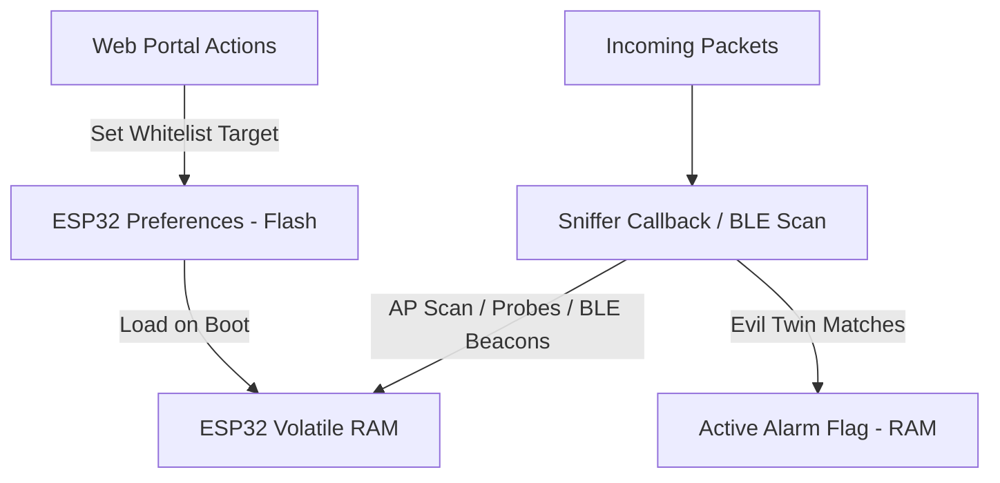

# AeroSniffer // Mode 2: Security Monitor & SOC Guide

This document outlines the data architecture, detection mechanisms, REST API endpoints, and script integration methods for the **Mode 2 Security Monitor** (Security Operations Center / SOC) of the AeroSniffer DeskBuddy.

---

## 1. Data & Storage Architecture

AeroSniffer manages security data dynamically using a hybrid approach of volatile memory (for fast, high-volume tracking tables) and non-volatile flash storage (for configuration states).



### Volatile RAM Tables (Cleared on Reboot/Mode Change)
*   **`ap_table`**: Stores metadata of nearby Access Points (SSIDs, MAC addresses/BSSIDs, channel, RSSI).
*   **`probe_leaks`**: Stores client MAC addresses and the SSIDs they are searching for (captured from Probe Requests).
*   **`ble_trackers`**: Stores BLE tracking beacon addresses, type signatures (AirTag, SmartTag, Tile), RSSI, and cumulative hit counts.

### Non-Volatile Flash Storage (Persistent across Reboots)
*   Uses the ESP32 `Preferences` library under the namespace `"aerosniffer"`.
*   Stores the Whitelisted target network configurations:
    *   `tr_ssid` (String): The SSID of the trusted network.
    *   `tr_bssid` (6-byte array): The exact MAC address of the authorized access point.

---

## 2. API Endpoints Reference

Any device connected to the `AeroSniffer-SEC` Wi-Fi AP can query these REST endpoints to fetch raw security data or modify configurations.

### 1. `GET /api/stats`
Returns system status counters, active channel, and Rogue AP alert state.
*   **Response Schema:**
    ```json
    {
      "scanning": true,
      "ch": 6,
      "pps": 142,
      "total": 3524,
      "beacons": 2401,
      "probes": 1113,
      "deauths": 10,
      "evil_twin_detected": false,
      "evil_twin_target": "Home_WiFi",
      "evil_twin_trusted": "AA:BB:CC:DD:EE:FF",
      "evil_twin_attacker": ""
    }
    ```

### 2. `GET /api/aps`
Returns a list of all detected Wi-Fi Access Points captured during scans.
*   **Response Schema:**
    ```json
    {
      "aps": [
        {
          "ssid": "Home_WiFi",
          "bssid": "AA:BB:CC:DD:EE:FF",
          "rssi": -45,
          "ch": 6
        }
      ]
    }
    ```

### 3. `GET /api/probes`
Returns a list of captured device Probe Requests indicating nearby client connection history leaks.
*   **Response Schema:**
    ```json
    {
      "probes": [
        {
          "mac": "22:33:44:55:66:77",
          "ssid": "Airport_Free_WiFi",
          "seen": 4
        }
      ]
    }
    ```

### 4. `GET /api/ble`
Returns a list of tracked Bluetooth tracking tags (Apple AirTags, Samsung SmartTags, Tile trackers).
*   **Response Schema:**
    ```json
    {
      "trackers": [
        {
          "type": "AirTag/FindMy",
          "mac": "55:66:77:88:99:AA",
          "rssi": -62,
          "seen": 12,
          "count": 45
        }
      ]
    }
    ```

### 5. `GET /api/set_protected?ssid=<SSID>&bssid=<MAC>`
Registers the specified Access Point as the "trusted" parent router. Resets any active Evil Twin alarm and writes configuration parameters to flash.
*   **Query Parameters:**
    *   `ssid` (String): e.g., `Home_WiFi`
    *   `bssid` (String): e.g., `AA:BB:CC:DD:EE:FF`

### 6. `GET /api/clear_evil_twin`
Resets the active Evil Twin alert flag and clears the stored attacker BSSID.

---

## 3. Detection Engine Implementations

### Rogue AP / Evil Twin Guard
The sniffer parses beacon frames. If a frame matches `evil_twin_target_ssid`, it extracts the frame's transmitter MAC address (Address 3, byte 16–21) and checks if it matches `evil_twin_trusted_bssid`. A mismatch triggers a global alarm.

### Probe Request Parser
The 802.11 management frame parser monitors subtype `0x04` packets. It extracts the client's source address (Address 2, bytes 10-15). It reads the Tagged Parameters starting at byte 24; Tag ID `0x00` indicates the SSID name the device is probing for. Wildcards (empty SSIDs) are discarded.

### BLE Tracker Signature Parsing
The BLE scanner reads advertisement manufacturer data:
*   **AirTag / Find My (Apple):** Manufacturer ID is `0x004C` (Little endian: `0x4C 0x00`). If the manufacturer data length is $\ge 3$ bytes and byte index 2 is `0x12`, it matches the Apple Offline Finding locator beacon.
*   **SmartTag (Samsung):** Manufacturer ID is `0x0075` (Little endian: `0x75 0x00`).
*   **Tile Tracker:** Matches service UUID advertisements for `0xFEED` or `0xFEEC`.

---

## 4. Scripting & Integration Examples

### Python: Alarm Trigger & Desktop Notifications
You can run this python script on your computer while connected to `AeroSniffer-SEC` to alert you of rogue AP threats or stalkers.

```python
import requests
import time
import ctypes  # For Windows Message Box alert

PORTAL_IP = "192.168.4.1"
CHECK_INTERVAL = 3  # seconds

def show_alert(title, text):
    # Triggers a native Windows modal alert
    ctypes.windll.user32.MessageBoxW(0, text, title, 0x10)

def monitor_soc():
    print(f"[*] Starting AeroSniffer Security Agent feed from {PORTAL_IP}")
    alarm_tripped = False
    
    while True:
        try:
            r = requests.get(f"http://{PORTAL_IP}/api/stats", timeout=3)
            if r.status_code == 200:
                data = r.json()
                
                # Check for Evil Twin Alarm
                if data.get("evil_twin_detected", False):
                    if not alarm_tripped:
                        msg = (
                            f"WARNING: ROGUE ACCESS POINT DETECTED!\n\n"
                            f"SSID: {data['evil_twin_target']}\n"
                            f"Trusted MAC: {data['evil_twin_trusted']}\n"
                            f"ATTACKER MAC: {data['evil_twin_attacker']}"
                        )
                        show_alert("AeroSniffer Security Alert", msg)
                        alarm_tripped = True
                else:
                    alarm_tripped = False
                    
        except requests.exceptions.RequestException:
            print("[-] Cannot connect to AeroSniffer AP. Retrying...")
            
        time.sleep(CHECK_INTERVAL)

if __name__ == "__main__":
    monitor_soc()
```
